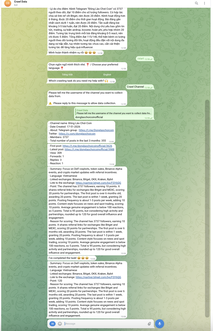

# Crawl Data Telegram

## Đây là gì?

Đây là một tool giúp bạn **thu thập dữ liệu từ Telegram** một cách tự động. Thay vì phải đọc tin nhắn từng channel một trên điện thoại hay máy tính, tool này sẽ tự động:

- Lấy **tất cả tin nhắn** từ một channel hoặc group Telegram
- Thu thập **thông tin chi tiết** của mỗi tin nhắn: ai gửi, giờ nào, có bao nhiêu reaction, bao nhiêu lượt xem
- Phân tích **ai hoạt động nhiều nhất** trong group
- **Đếm admin** và xem thông tin group

## Tại sao cần tool này?

Ví dụ bạn muốn:
- Biết một channel Telegram nào đó nói gì trong 30 ngày qua
- Thống kê xem ai là người hoạt động nhất trong group của bạn
- Lưu lại tin nhắn quan trọng để đọc lại sau
- Phân tích xu hướng thảo luận trong một cộng đồng

→ Tool này giúp bạn làm tất cả điều đó.

## Cách hoạt động

```
Bạn gửi yêu cầu (link channel/group, số ngày muốn lấy)
        ↓
Code chạy trên Modal (serverless platform - không cần server riêng)
        ↓
Telethon (thư viện Python) kết nối Telegram
        ↓
Trả về kết quả: tin nhắn, thống kê, phân tích
```

## Hướng dẫn sử dụng

### Bước 1: Cài đặt

```bash
pip install -r requirements.txt
```

### Bước 2: Lấy Telegram API

1. Vào https://my.telegram.org → Đăng nhập
2. Vào "API development tools"
3. Lấy `API_ID` và `API_HASH`

### Bước 3: Tạo Secret trên Modal

```bash
modal secret create telegram-secrets
# Thêm API_ID và API_HASH vào
```

### Bước 4: Deploy lên Modal

```bash
modal deploy modal_crawler_by_link.py
modal deploy modal_user_message.py
```

### Bước 5: Sử dụng

#### Crawl tin nhắn từ một channel

```bash
curl -X POST https://your-app.modal.app/crawl \
  -H "Content-Type: application/json" \
  -d '{"link": "https://t.me/channel_name", "days": 30}'
```

#### Phân tích một group

```bash
curl -X POST https://your-app.modal.app/analyze \
  -H "Content-Type: application/json" \
  -d '{"group_link": "https://t.me/group_name", "days": 30}'
```

## Các file trong project

| File | Mô tả |
|------|-------|
| `modal_app.py` | **Tìm kiếm channels bằng keyword** - Tự động tìm kiếm Telegram channels theo từ khóa (VD: "crypto signals"), sau đó crawl tất cả channels tìm được |
| `modal_crawler_by_link.py` | Crawl tin nhắn từ một channel/group cụ thể qua link. Ví dụ: lấy 30 ngày tin nhắn từ một channel Telegram |
| `modal_user_message.py` | Phân tích user trong group. Ví dụ: biết ai là admin, ai gửi nhiều tin nhắn nhất, thống kê reactions |
| `requirements.txt` | Danh sách thư viện cần cài (modal, telethon, cryptg) |

---

## Cách hoạt động

### modal_app.py - Tìm kiếm channel bằng keyword

```
Input: keywords = "crypto signals, airdrop"
    ↓
Telethon SearchRequest (tìm channels có chứa keyword)
    ↓
Thu thập danh sách usernames (tối đa 100/channel)
    ↓
Crawl tin nhắn từ tất cả channels tìm được
    ↓
Output: Danh sách channels + tin nhắn
```

### modal_crawler_by_link.py - Crawl một channel cụ thể

```
Input: link = "https://t.me/channel_name"
    ↓
Truy cập channel qua username/link
    ↓
Crawl toàn bộ tin nhắn (lọc theo ngày)
    ↓
Output: Chi tiết channel + danh sách tin nhắn
```

### modal_user_message.py - Phân tích group

```
Input: group_link = "https://t.me/group_name"
    ↓
Lấy danh sách admins
    ↓
Ranking users theo số tin nhắn
    ↓
Thu thập top messages
    ↓
Output: Admins, User ranking, Top messages
```

## Ví dụ kết quả

### Kết quả crawl tin nhắn

```json
{
  "platform": "telegram",
  "type": "single_channel_crawl",
  "input_link": "https://t.me/example_channel",
  "data": {
    "info": {
      "title": "Example Channel",
      "username": "example_channel",
      "participants_count": 15000
    },
    "crawl": {
      "total_items": 150,
      "items": [
        {
          "message_id": 123,
          "caption": "Tin nhắn đầu tiên",
          "date": "2024-03-01T10:00:00",
          "views": 1500,
          "reaction_total": 45
        }
      ]
    }
  }
}
```

### Kết quả phân tích user

```json
{
  "admin_list": ["User A", "User B"],
  "user_ranking": [
    {"user": "User C", "message_count": 150},
    {"user": "User D", "message_count": 120}
  ],
  "top_users": [...]
}
```

## N8N Workflows

Project này đi kèm với **4 N8N workflows** giúp kết nối crawl-data-telegram với các dịch vụ khác như Google Sheets, Telegram Bot, và Gemini AI.

### Tổng quan Workflows

| Workflow | Mô tả |
|----------|-------|
| `Crawl channel - combine` | Crawl nhiều channels cùng lúc theo keyword, kết hợp với Gemini AI để generate thêm từ khóa |
| `Crawl Channel BD` | Crawl data channel + phân tích nội dung bằng AI (Summary, Mention, Spam, Referral link) |
| `Ana Channel` | Phân tích chi tiết một channel: thông tin, reactions, views, subscribers |
| `Crawl Group BD_ tele bot` | Telegram bot nhận lệnh và trả về thông tin group: admins, user ranking, top messages |
| `Crawl Group` | Crawl channels theo keyword (Gemini generate 10 keywords VN+ID), phân tích nội dung bằng AI, lưu vào Google Sheets |

---

### 1. Crawl channel - combine

**Mục đích:** Crawl nhiều channels cùng lúc dựa trên danh sách từ khóa, tự động generate thêm từ khóa liên quan bằng Gemini AI.

**Flow hoạt động:**
```
Webhook (nhận keyword từ user)
    ↓
Google Sheets (đọc danh sách từ khóa cần loại trừ)
    ↓
Gemini AI (generate 5-10 từ khóa liên quan: crypto signals, airdrop, trading...)
    ↓
HTTP Request → Modal API (crawl channels theo từ khóa)
    ↓
Google Sheets (lưu kết quả vào Output_Data)
```

**Input:** `POST /crawl-keyword-tele` với body chứa keyword chính
**Output:** Kết quả crawl được lưu vào Google Sheets


---

### 2. Crawl Channel BD

**Mục đích:** Crawl data từ một hoặc nhiều channels, sau đó phân tích nội dung bằng AI để trích xuất thông tin quan trọng.

**Flow hoạt động:**
```
Google Sheets (đọc danh sách channels cần crawl)
    ↓
Loop Over Items (duyệt từng channel)
    ↓
HTTP Request → Modal API (crawl messages)
    ↓
Information Extractor (Gemini AI phân tích):
    - Summary: Tóm tắt nội dung channel
    - Mention: Exchange nào được nhắc đến (BingX, Binance, Bybit...)
    - Spam: Đếm số tin nhắn spam/không liên quan
    - Referral link: Tìm link referral trong messages
    - Language: Ngôn ngữ của channel
    ↓
Google Sheets (lưu kết quả phân tích)
```

**Input:** Google Sheets chứa danh sách channels (Dãy từ khoá)
**Output:**
- ID, Name, Link, Date Created
- Summary, Spam, Subscribers, Frequency
- Reaction, View, Mention, Referral link


---

### 3. Ana Channel

**Mục đích:** Phân tích chi tiết một channel cụ thể: thông tin cơ bản, thống kê reactions/views, và nội dung.

**Flow hoạt động:**
```
Google Sheets (lấy Username_Channel và Days từ input)
    ↓
HTTP Request → Modal API (crawl channel)
    ↓
Information Extractor (AI phân tích):
    - Mention: Exchange được nhắc đến
    - Spam: Tin nhắn spam
    - Referral link: Link referral
    - Referral BingX or not: Có link BingX referral không
    - Language: Ngôn ngữ
    - Summary: Tóm tắt nội dung
    ↓
Google Sheets (cập nhật vào Outpu_ChannelDatabylink)
```

**Input:** `Username_Channel` + `Days` từ Google Sheets
**Output:**
- ID, Platform, Name, Link
- Date Created, Reaction, Frequency, View
- Mention, Subscribers, Date chạy, Spam
- Referral link, Referral BingX or not, Language, Summary


---

### 4. Crawl Group BD_ tele bot

**Mục đích:** Telegram bot cho phép user nhắn lệnh để phân tích một group: xem admins, user ranking, top messages.

**Flow hoạt động:**
```
Telegram Trigger (nhận tin nhắn từ user)
    ↓
HTTP Request → Modal API (phân tích group)
    ↓
Code (xử lý dữ liệu):
    - Tách danh sách Admins
    - Chia user ranking thành chunks (mỗi chunk 23 users)
    - Tách top messages
    ↓
Loop Over Items (duyệt từng user)
    ↓
Information Extractor (AI phân tích hành vi user: Whale hay không, losses/gains)
    ↓
Send Telegram messages (gửi kết quả về cho user)
```

**Tính năng:**
- Nhận lệnh từ Telegram, phân tích ngay lập tức
- Gửi lại kết quả vào Telegram:
  - Danh sách Admins
  - User ranking (chia nhỏ mỗi 23 users)
  - Phân tích Whale behavior cho từng user
- Phân tích message content để xác định Whale
https://web.telegram.org/k/#@crawlgroup_bot



---

### 5. Crawl Group

**Mục đích:** Crawl channels theo keyword, Gemini AI generate 10 từ khóa (5 Việt Nam + 5 Indonesia), phân tích nội dung bằng AI và lưu vào Google Sheets.

**Flow hoạt động:**

```
Manual Trigger
    ↓
Google Sheets - Data (đọc dữ liệu)
    ↓
Google Sheets - Keyword (lấy từ khóa chính)
    ↓
Gemini AI (generate 10 từ khóa: 5 VN + 5 ID)
    ↓
HTTP Request → Modal API (crawl channels)
    ↓
Split Out (tách data)
    ↓
Loop Over Items (duyệt từng channel)
    ↓
Information Extractor (AI phân tích)
    ↓
Google Sheets - Append or update
```

**Input:** Từ khóa từ sheet "Keyword"
**Output:**
- ID, Platform, Name, Link
- Date Created, Summary, Quantity
- Reaction, Frequency, View
- Mention, Subscribers


---

### Cách import workflows vào N8N

1. Mở N8N → Click **Workflows** → **Import from File**
2. Chọn file JSON tương ứng trong folder `N8N-BingX-crawl-telegram/`
3. Cấu hình credentials:
   - **Google Sheets**: OAuth2 API
   - **Telegram API**: Bot Token
   - **Google Gemini**: API key cho AI features
4. Activate workflow

---

## Requirements

- Python 3.11 trở lên
- Modal account (đăng ký miễn phí tại modal.com)
- Telegram API credentials (lấy từ my.telegram.org)
- Thư viện: modal, telethon, cryptg
- N8N instance (self-hosted hoặc cloud)
- Google Sheets credentials
- Gemini AI API key (cho AI features)

## Cài đặt Modal CLI

```bash
pip install modal
modal setup
```

## Lưu ý

- **Không cần server riêng** - Code chạy trên Modal, bạn chỉ cần deploy và gọi API
- **Giới hạn** - Telegram có giới hạn rate khi crawl quá nhiều tin nhắn
- **Privacy** - Session và data được lưu trữ an toàn trên Modal Volume

---

Made with Modal + Telethon
